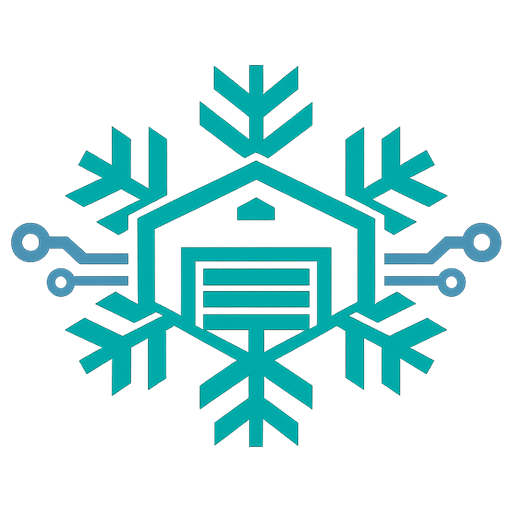
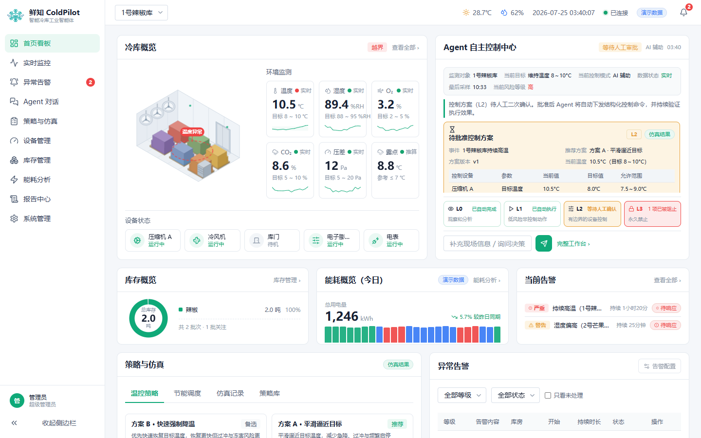
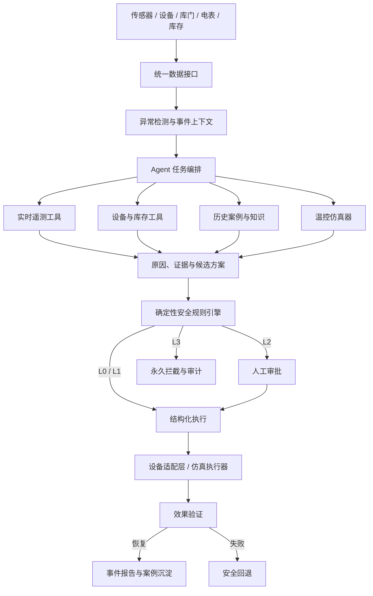

<p align="center">
  
</p>

<h1 align="center">鲜知 ColdPilot</h1>

<p align="center">
  <strong>安全可控的果蔬冷库工业智能体</strong>
</p>

<p align="center">
  让冷库从“发现问题后人工处理”，升级为“主动感知、解释原因、生成方案、安全执行并验证结果”。
</p>

<p align="center">
  
  
  
  
  
</p>

<p align="center">
  <a href="#快速开始">快速开始</a> ·
  <a href="#核心闭环">核心闭环</a> ·
  <a href="#工业安全边界">安全边界</a> ·
  <a href="#系统架构">系统架构</a> ·
  <a href="#项目截图">项目截图</a> ·
  <a href="submission/GOAI-ColdPilot/">赛事材料</a>
</p>

---

## 项目简介

**鲜知 ColdPilot** 是一个面向果蔬冷库的工业 Agent 系统，覆盖异常诊断、保鲜决策、能耗优化、设备调控、审批执行与结果复盘。

它不是给传统监控大屏加一个聊天框，也不是让大模型直接控制 PLC。ColdPilot 将环境、设备、库存、能耗和历史事件组织成可执行的任务上下文，由 Agent 调用受限工具完成诊断和方案编排，再由确定性安全规则、人工审批和设备保护机制约束执行。

当前项目围绕一个可重复演示的主场景展开：

> **1 号辣椒库温度持续升高**，系统主动识别异常，调用实时遥测、库门记录、库存批次、设备日志和历史案例完成原因诊断；随后比较两种温控方案，在 L2 人工审批后进行仿真执行，并持续验证冷库是否真正恢复。

当前版本为 **参赛 MVP / 仿真验证阶段**，已完成 React + FastAPI 全栈实现、前后端 HTTP 联调、Agent 工具调用、策略仿真、L2 审批、L3 拦截、执行验证、报告与审计闭环。



---

## License

本项目源代码采用 **Apache License 2.0** 发布。

完整许可协议见：

- [LICENSE](LICENSE)
- [NOTICE](NOTICE)

“鲜知 ColdPilot”名称、Logo、产品标识和相关品牌资产不包含在 Apache License 2.0 授权范围内。

详见：

- [TRADEMARKS.md](TRADEMARKS.md)

第三方依赖、模型、数据集和外部素材仍遵循各自的许可协议。

详见：

- [THIRD_PARTY_NOTICES.md](THIRD_PARTY_NOTICES.md)

---

## 核心闭环

```text
持续感知
  ↓
异常识别
  ↓
Agent 自动创建任务
  ↓
多工具诊断与证据汇总
  ↓
候选方案生成
  ↓
温控与能耗仿真
  ↓
确定性安全校验
  ↓
L2 人工审批 / L3 永久拦截
  ↓
结构化控制执行
  ↓
效果验证与安全回退
  ↓
事件报告与审计沉淀
```

ColdPilot 的任务终点不是“生成一段回答”，而是：

- 异常得到验证性恢复；或
- 系统安全回退并明确转交人工。

---

## 核心能力

### 主动式异常处置

- 持续读取温度、湿度、O₂、CO₂、压差、库门、设备、电表和库存状态
- 识别持续越界、趋势异常、设备效率下降和控制未生效
- 无需用户先发起对话即可自动创建诊断任务
- 在首页、工作台和告警中心持续同步任务阶段

### 多工具诊断与可解释证据

Agent 可调用：

- 实时遥测查询
- 库门与入库记录
- 压缩机、风机和阀门状态
- 历史相似事件
- 冷库知识与运行规则
- 温控仿真与安全检查

诊断结果包含：

- 原因排序与置信度
- 支持证据与反向证据
- 不确定信息
- 推荐排查顺序
- 工具输入、输出、耗时和状态留痕

### 方案仿真与风险比较

系统可比较多个控制方案的：

- 预计恢复时间
- 仿真能耗
- 温度过冲风险
- 冻害风险
- 压缩机启停次数
- 控制参数、执行时窗与回退条件

当前仿真器采用确定性的一阶热力学近似，用于验证产品闭环和方案比较，不代表真实冷库数字孪生精度。

### 执行后验证

ColdPilot 严格区分：

- `approved`：方案获批
- `executing`：结构化命令正在执行
- `verifying`：系统正在观察环境与设备响应
- `recovered`：恢复条件已经持续满足

执行完成不等于异常恢复；只有验证成功后，任务才会进入 `recovered`。

---

## 工业安全边界

ColdPilot 的安全机制不依赖大模型自觉，也不把安全判断写进提示词。

| 等级 | 典型能力 | 执行策略 |
| --- | --- | --- |
| **L0** | 读取数据、查询知识、生成报告 | 自动执行并记录 |
| **L1** | 运行仿真、重新采样、增加观察任务 | 规则校验后自动执行 |
| **L2** | 调整目标温度、风机、压缩机负载、阀门开度 | 必须人工二次确认 |
| **L3** | 关闭联锁、越过硬件保护、绕过安全边界 | 永久禁止，仅生成安全审计记录 |

所有控制动作均采用结构化参数，并经过：

- 参数白名单
- 上下限检查
- 变化速率检查
- 状态与权限检查
- 方案版本绑定
- 审批有效性检查
- 回退条件检查
- 完整操作审计

> 大模型不直接向 PLC 发送自由文本指令。PLC 联锁、设备保护和传统控制始终拥有更高优先级。

---

## 系统架构



### 技术实现

| 层级 | 技术与职责 |
| --- | --- |
| 前端 | React 18、TypeScript、Vite、React Router、ECharts、CSS Modules |
| 接口契约 | OpenAPI 3.1、`ColdPilotClient`、HTTP / Mock 双模式 |
| 后端 | FastAPI、Pydantic v2、SQLAlchemy 2、Alembic、SQLite WAL |
| Agent | 默认 deterministic Agent；可选 OpenAI-compatible LLM 综合模式 |
| 任务执行 | 进程内持久化任务 worker，诊断与执行状态可查询、可恢复 |
| 安全 | L0-L3 分级、方案版本绑定、幂等控制、L3 拦截、审计哈希链 |
| 测试 | Vitest、Testing Library、pytest、httpx、jsonschema、ruff |

---

## 已实现页面

| 页面 | 路由 | 主要能力 |
| --- | --- | --- |
| 首页看板 | `/command-center` | 冷库、设备、库存、能耗、告警、Agent 自主任务概览 |
| 实时监控 | `/monitoring` | 多指标时序、目标区间、事件标记、数据质量与设备状态 |
| 异常告警 | `/events` | 告警筛选、阶段状态、详情与诊断入口 |
| Agent 工作台 | `/workbench` | 工具轨迹、原因证据、方案、审批、执行、验证与报告 |
| 策略与仿真 | `/strategy` | A/B 方案、预测曲线、安全校验和 L2 审批 |
| 设备管理 | `/devices` | 设备状态、参数、健康度、关联异常和维护建议 |
| 库存管理 | `/inventory` | 批次、环境适宜性、风险和剩余安全窗口 |
| 能耗分析 | `/energy` | 能耗趋势、峰平谷、设备构成与仿真节能比较 |
| 报告中心 | `/reports` | 事件报告、安全审计和执行复盘 |
| 系统管理 | `/settings` | 数据源、安全规则、Agent 版本和界面设置 |

---

## 项目截图

更多页面截图见 [`frontend/acceptance/`](frontend/acceptance/) 与 [`submission/GOAI-ColdPilot/03-Demo截图/`](submission/GOAI-ColdPilot/03-Demo截图/)。

---

## 快速开始

（保持原内容）