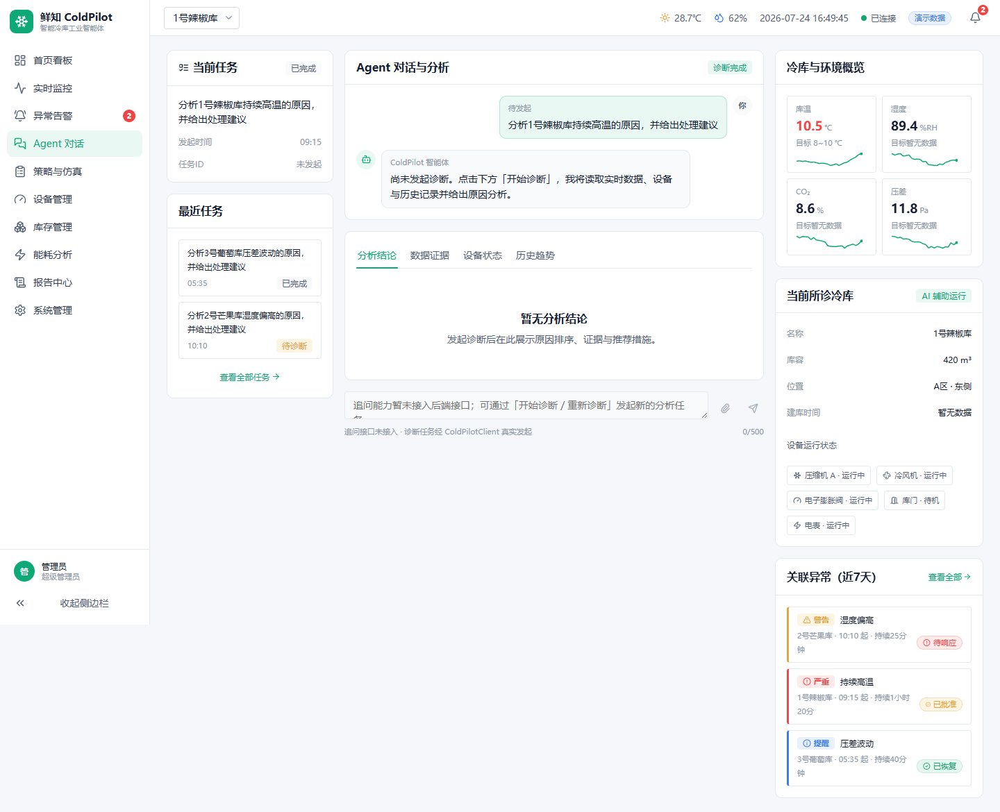
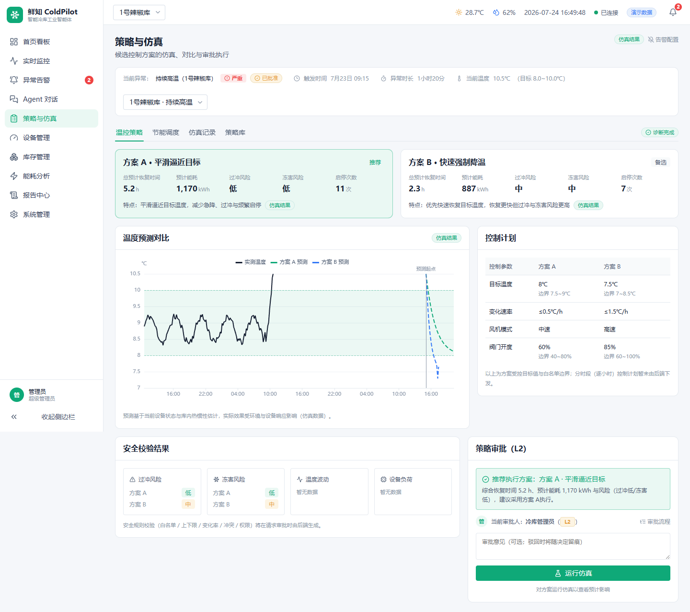
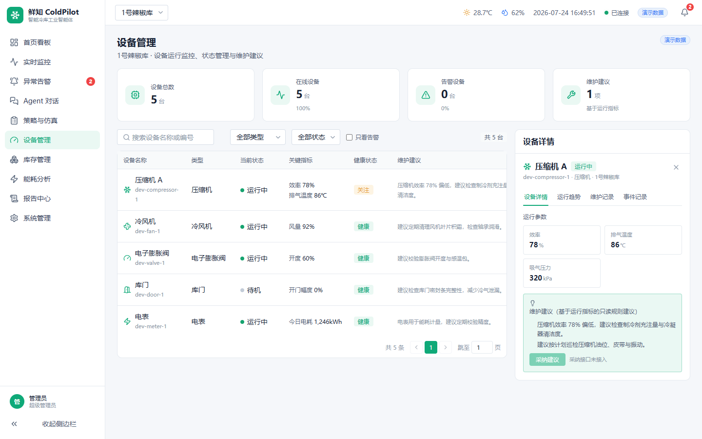

# 鲜知 ColdPilot

<p align="center">
  <b>安全可控的冷库工业智能体</b>
</p>

<p align="center">
  面向果蔬冷库的异常诊断、保鲜决策、能耗优化与安全调控 Agent
</p>

---

## 项目简介

鲜知 ColdPilot 是一个面向果蔬冷库场景的工业智能体系统。

它不是在传统监控大屏上增加一个聊天窗口，而是在工业安全边界内，将：

**状态感知 → 异常识别 → 原因诊断 → 工具调用 → 方案生成 → 风险校验 → 人工审批 → 仿真执行 → 效果验证 → 报告沉淀**

组织成完整 Agent 闭环。

系统围绕典型场景：

> 1 号辣椒库温度持续升高，Agent 自动发现异常，分析原因，比较控制方案，在安全边界内协助完成恢复。

---

## 核心能力

### 🤖 工业 Agent 任务闭环

Agent 能够：

- 持续感知冷库环境与设备状态
- 自动发现异常趋势
- 调用实时数据、设备日志、历史案例等工具
- 输出原因排序、置信度和证据
- 生成控制方案
- 跟踪任务状态和执行结果

---

### 🔍 可解释异常诊断

针对温度异常等问题，系统综合：

- 温湿度数据
- O₂ / CO₂ / 压差
- 库门事件
- 入库批次
- 压缩机效率
- 风机与阀门状态
- 历史案例

输出：

- 可能原因排序
- 支持证据
- 反向证据
- 推荐排查顺序
- 不确定信息

---

### 📊 策略仿真与风险比较

系统生成多个控制方案，并比较：

- 恢复时间
- 能耗
- 温度过冲风险
- 冻害风险
- 压缩机启停次数

通过仿真辅助人工决策。

---

### 🛡️ 工业安全边界

ColdPilot 不让大模型直接控制设备。

采用分级控制：

|等级|能力|
|-|-|
|L0|读取数据、查询知识、生成报告，自动执行|
|L1|低风险任务、仿真任务，自动执行|
|L2|改变设备运行参数，需要人工二次确认|
|L3|越过联锁或设备保护范围，永久禁止|

所有控制动作经过：

- 参数白名单
- 上下限校验
- 变化速率校验
- 权限校验
- 审计记录

---

## 系统架构

```
                    Web 控制台
                        │
              ColdPilot Agent 应用层
                        │
 ┌───────────────┬───────────────┐
 │ Agent 编排层   │ 安全规则引擎   │
 └───────────────┴───────────────┘
                        │
        工具层 / 仿真器 / 知识库 / 预测模型
                        │
        设备适配层 / 数据接口 / 控制接口
                        │
        温湿度 / 设备 / 库门 / 电表 / 库存
```

当前版本包含：

- React + TypeScript 前端
- FastAPI 后端
- OpenAPI 接口契约
- 工业 Agent 任务编排
- 仿真控制流程
- 审批与安全机制
- 审计记录

---

## Demo 主流程

```
异常发现
  ↓
Agent 自动诊断
  ↓
多工具调用
  ↓
原因与证据分析
  ↓
A/B 控制方案比较
  ↓
仿真验证
  ↓
L2 人工审批
  ↓
结构化执行
  ↓
恢复验证
  ↓
事件报告
```

---

## 项目截图

### 指挥中心


### Agent 工作台



### 策略与仿真



### 设备管理



---

## 技术栈

### Frontend

- React 18
- TypeScript
- Vite
- React Router
- ECharts
- CSS Modules
- Vitest

### Backend

- Python 3.12
- FastAPI
- Pydantic
- SQLAlchemy
- Alembic
- SQLite
- Pytest

---

## 仓库结构

```
coldpilot/
├── frontend/              # React 前端
├── backend/               # FastAPI 后端
├── docs/
│   ├── product/           # 产品需求文档
│   ├── contracts/         # OpenAPI 与接口契约
│   └── handoff/           # 前后端交接文档
├── submission/            # 赛事提交材料
└── README.md
```

---

## 快速运行

### Backend

```bash
cd backend
python -m venv .venv
pip install -r requirements.txt
python -m alembic upgrade head
python -m uvicorn app.main:app --port 8000
```

### Frontend

```bash
cd frontend
pnpm install
pnpm dev
```

访问：

```
http://localhost:5173/command-center
```

---

## 测试

Frontend:

```bash
pnpm typecheck
pnpm test
pnpm lint
pnpm build
```

Backend:

```bash
pytest
ruff check app tests
```

---

## 数据与真实性声明

当前版本为：**参赛 MVP / 仿真验证阶段**。

其中：

- 冷库数据为演示数据
- 控制执行为仿真执行
- 能耗、恢复时间等指标为模拟或仿真结果
- 尚未连接真实 PLC 和真实工业设备

系统设计目标是验证工业 Agent 闭环能力，而非宣称已经完成真实商业部署。

---

## 开放方向

未来计划开放：

- 冷库异常事件 Schema
- 传感器模拟数据集
- Cold Storage Simulator
- 工业诊断 Agent 模板
- 温控优化 Tool API
- 安全审批流程示例
- OpenAPI 接口规范

---

## License

待项目正式开源阶段补充。
